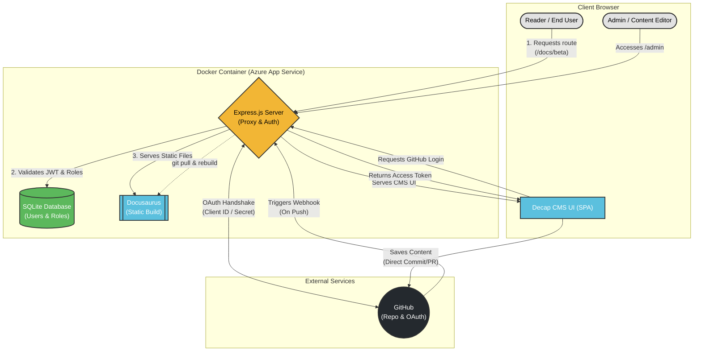

# Bankuity Documentation & CMS

A self-hosted, version-controlled documentation platform built with [Docusaurus](https://docusaurus.io/) and integrated with [Decap CMS](https://decapcms.org/). 

This project uses a custom Express.js backend to serve the static site, handle JWT-based role authentication (SQLite), and act as a secure OAuth proxy for GitHub, allowing seamless content editing directly to the repository.



## Features
- **Static Site Generation:** Docs and blog powered by Docusaurus.
- **Git-based CMS:** Decap CMS integrated via GitHub OAuth (No third-party cloud CMS required).
- **Role-Based Access Control:** Custom Express server protecting specific routes (`/docs/beta`, `/docs/enterprise`, `/admin`).
- **Self-Hosted:** Fully Dockerized and ready for deployment.

---

## Prerequisites
- Node.js >= 20.0
- Docker & Docker Compose (Optional, but recommended)
- A GitHub OAuth App (for CMS authentication)

### GitHub OAuth Setup
To allow the CMS to commit changes to the repository:
1. Go to your GitHub Settings > Developer settings > OAuth Apps > **New OAuth App**.
2. Set **Homepage URL** to your base URL (e.g., `http://localhost:3000`).
3. Set **Authorization callback URL** to `<BASE_URL>/api/auth/github/callback`.
4. Generate and save the **Client ID** and **Client Secret**.

---

## Environment Setup

Create a `.env` file in the root directory and add the following variables:

```env
# Server Config
PORT=3000
JWT_SECRET=super_secret_bankuity_key_2024
BASE_URL=http://localhost:3000

# GitHub OAuth (Decap CMS)
GITHUB_CLIENT_ID=your_github_client_id_here
GITHUB_CLIENT_SECRET=your_github_client_secret_here
GITHUB_BRANCH=dev # Branch where the CMS will commit changes
```

## Running the Project

### Option A: Using Docker (Recommended)
This is the closest representation of the production environment.

```bash
# Build and start the container
docker-compose up --build
```

### Option B: Running Locally (Node.js)
If you want to run the project outside of Docker for development:

```bash
# Install dependencies
npm install

# Run Docusaurus and the Express server concurrently
npm run dev
```

---

## Accessing the App

Once the server is running, you can access the following routes:

- **Public Site:** [http://localhost:3000](http://localhost:3000)
- **CMS Admin Panel:** [http://localhost:3000/admin](http://localhost:3000/admin)

### Credentials (Seed Data)

Upon the first execution, the SQLite database is automatically seeded with the following default users:

| Username         | Password      | Roles (Access Level)           |
| :---             | :---          | :---                           |
| `admin`          | `password123` | `admin`, `beta`, `enterprise`  |
| `betatester`     | `bt123`       | `beta`                         |
| `enterpriseuser` | `ent123`      | `enterprise`                   |

You can also edit users and roles on the admin panel.